# ハンズオンシナリオ — 株式会社スノーリテール

**形式:** Cortex Code in Snowsight（ブラウザのみ・インストール不要）
**所要時間:** 約2時間（実作業 100分 + オープニング/まとめ 20分）

---

## 当日のゴール

1. **体験する:** Snowflake の中でアプリ・AI が動くことを自分の手で動かしてみる
2. **習得する:** Cortex Code in Snowsight の基本操作を身につける
3. **イメージする:** 自社の業務にどう活かせるかの具体像を持ち帰る

---

## 想定企業：株式会社スノーリテール

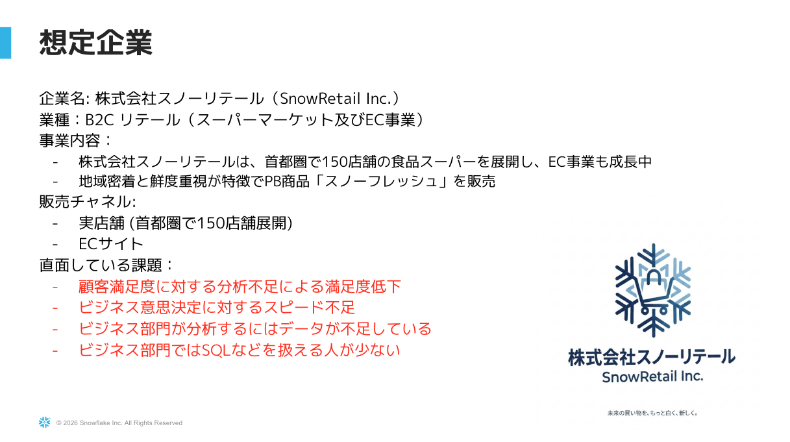

> 首都圏で **150店舗** を展開するリテール企業。EC事業も急成長中。

### 抱えている課題

| # | 課題 | 影響 |
|---|------|------|
| 1 | 売上データが**実店舗・EC・商品マスタでサイロ化**している | 部門横断の分析に時間がかかる |
| 2 | 分析できる人が限られ、**ビジネス部門のセルフサービス分析**が進まない | データが意思決定に活かせていない |
| 3 | 顧客レビューや社内ドキュメントなどの**非構造化データが未活用** | 改善のヒントが眠ったまま |
| 4 | ダッシュボード作成・配布の手間が大きい | 現場に届くまでが遅い |

### 本日のミッション

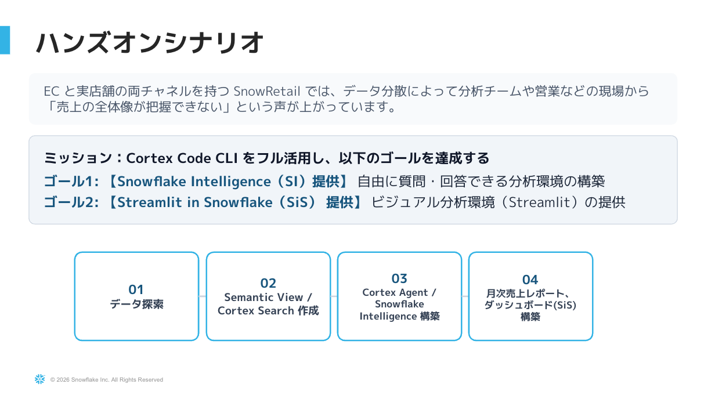

> あなたは**スノーリテールのデータ分析担当者**。Cortex Code in Snowsight を使って、
> これらの課題を **2時間で一気通貫に解決する PoC** を作る。

---

## 使用データ

| テーブル | 件数 | 概要 |
|---------|------|------|
| `RETAIL_DATA` | 550 | 実店舗の販売トランザクション |
| `EC_DATA` | 550 | EC の販売トランザクション |
| `PRODUCT_MASTER` | 125 | 商品マスタ（カテゴリ・価格） |
| `SNOW_RETAIL_DOCUMENTS` | 24 | 社内ドキュメント（返品ポリシー・施策資料など） |
| `CUSTOMER_REVIEWS` | 30 | 顧客レビュー（自由記述） |

---

## ストーリー（Step ごとに解決していく課題）

### Step 1 — まずデータを Snowflake に揃え、AI と対話を始める
> *「データが各所にバラけていて見られない」を解決する*

#### こんな場面、ありませんか？
あなたはスノーリテールのデータ分析担当として今朝、上司にこう言われました。
> 「ECと実店舗の売上、商品マスタが全部別ファイルになってる。何がどこにあるかも怪しい。
> とりあえず Snowflake に集めて、何があるか教えてくれない？」

従来なら：CSVをダウンロード → ローカルで開く → 列名を眺める → Excel で結合を試みる → 一日が終わる…。

#### 💡 Snowflake はこう解決します
- **Snowsight Workspace** にデータを集約 → ファイルもSQLも一箇所で管理
- **Cortex Code** に「どんなテーブルがある？」と日本語で聞くだけ → AIがSQLを自動生成・実行・要約

#### 🛠 ここで使う機能：**Cortex Code**

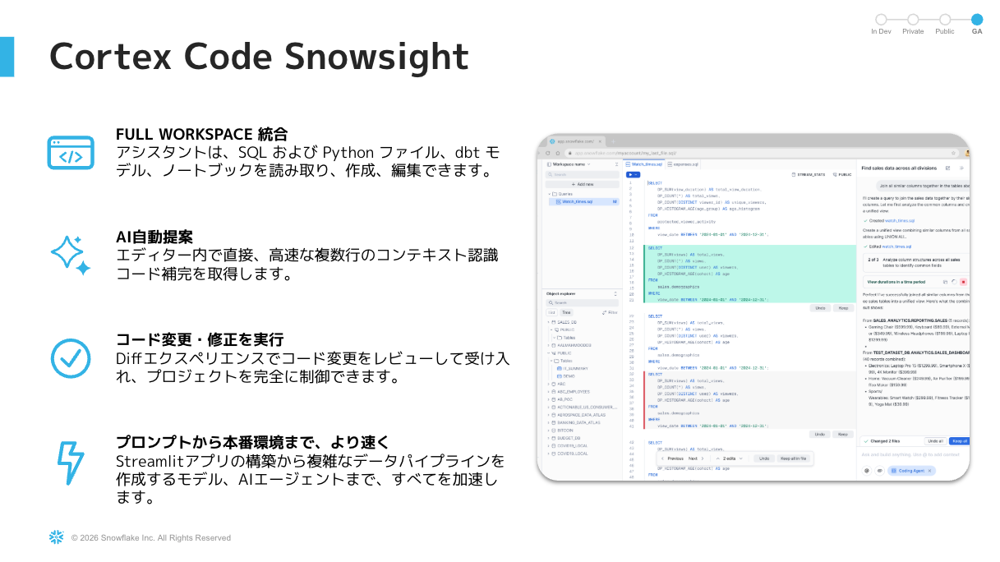

> Snowflake が公式提供する **AI コーディングアシスタント**。Snowsight ブラウザの中で動き、
> インストール不要・追加ライセンス不要。Snowflake のメタデータを理解しているので、
> 「このテーブルの中身を要約して」「売上トップ5を出して」のような自然言語指示でSQLを生成・実行してくれる。
> 生成過程の **思考** や **使ったSQL** も全部見えるので、ブラックボックスにならない。

#### ✨ 得られる体験
> 「データが揃った瞬間に、初手の探索が終わっている」  
> 5つのテーブル構造の把握が **数分** で完了。SQLをゼロから書いた人だけが知るあの苦労が消える。

---

### Step 2 — AI に「自社のルール」を覚えさせる
> *「人によって分析の前提がブレる」を解決する*

#### こんな場面、ありませんか？
あなたが「売上を計算して」とAIに頼むと、こんな答えが返ってきました。
> 「`RETAIL_DATA.TOTAL_PRICE` の合計を計算しました。」

…ECが含まれていません。隣のチームメンバーが同じ質問をすると、別の解釈で別の数字が返ってくる。
**「結局どっちが正しいの？」「うちの会社で "売上" って何を指す？」** 毎回説明し直すことに。

#### 💡 Snowflake はこう解決します
プロジェクトのルートに **`AGENTS.md`** という Markdown ファイルを置くだけで、
**Cortex Code が以降の全会話で自動的にそれを参照する** ようになります。

#### 🛠 ここで使う機能：**AGENTS.md**

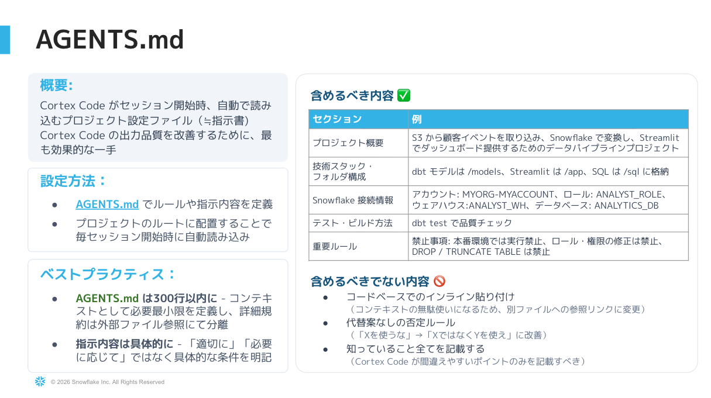

> Cortex Code への **永続的な指示書**。Workspace のルートに置く Markdown ファイルで、以下を定義できる：
> - **ビジネス定義:** 「売上 = RETAIL + EC の合算」「直近期間 = 過去3ヶ月」など
> - **SQL 規約:** 「必ずDB.SCHEMAを明示」「GROUP BY は列名で」など
> - **禁止事項:** 「DROP TABLE禁止」「個人情報を SELECT * しない」など
>
> Markdown なので Git で管理でき、**チーム全員に同じルールを共有** できる。
> "プロンプトエンジニアリング" を個人ワザではなくチーム資産にする仕組み。

#### ✨ 得られる体験
> 「AGENTS.md を保存した瞬間、AI が "うちの会社の文脈で考える人" になる」  
> 同じ質問でも、誰が・いつ聞いても同じ正しい答えが返る。  
> **AI ガバナンスのコア** がたった1ファイルで実現できる驚き。

---

### Step 3 — データに意味付けして、エージェントに統合する
> *「構造化データも非構造化データも、誰でも自然言語で聞きたい」を解決する*

#### こんな場面、ありませんか？
営業会議で部長がぽつり：
> 「今月、売上が落ちてるカテゴリってどれ？それの改善策、過去の社内資料に何かなかったっけ？」

これに答えるには：
1. SQL書ける人にカテゴリ別集計を依頼（半日）
2. 社内Wiki/SharePointを検索（数時間）
3. 結果を結合してレポート化（さらに数時間）

会議は終わっています。

#### 💡 Snowflake はこう解決します
**3つの Cortex AI** を組み合わせて、構造化と非構造化を **横断回答する AI** を作ります。

| サブステップ | 機能 | 解決すること |
|-------------|------|-------------|
| 3-1 | **Cortex Analyst (Semantic View)** | 数値テーブルを自然言語で聞ける |
| 3-2 | **Cortex Search** | テキストデータを意味で探せる |
| 3-3 | **Cortex Agent** | 上記2つを束ねた "考えるAI" |

#### 🛠 ここで使う機能

**Cortex Analyst（Semantic View）**

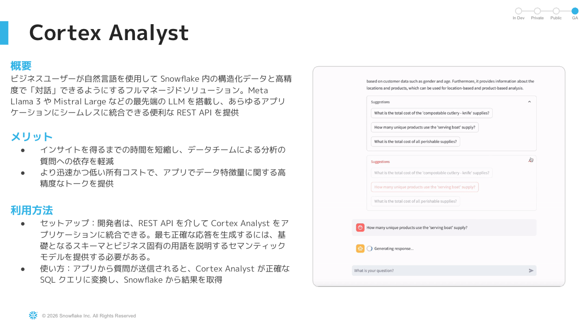
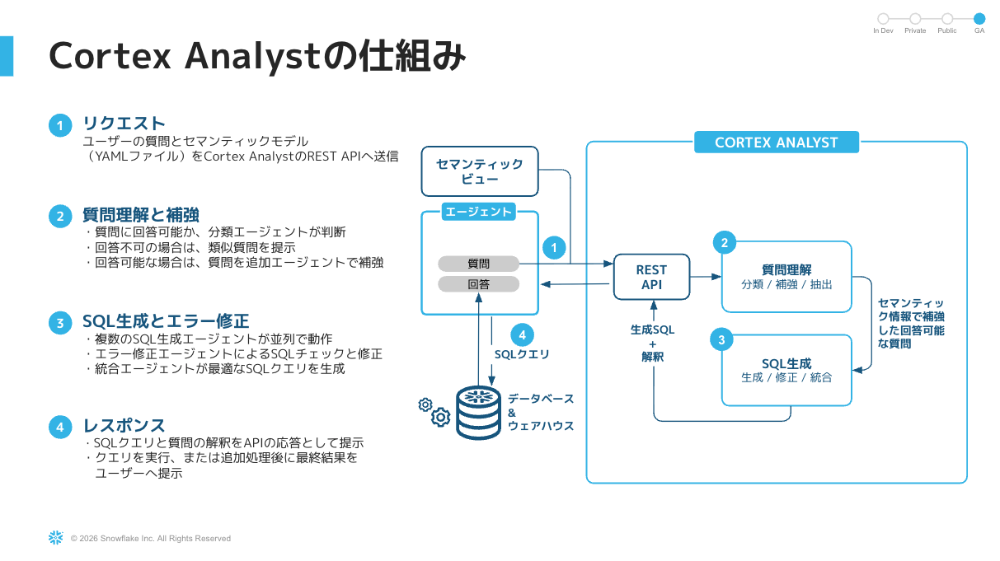
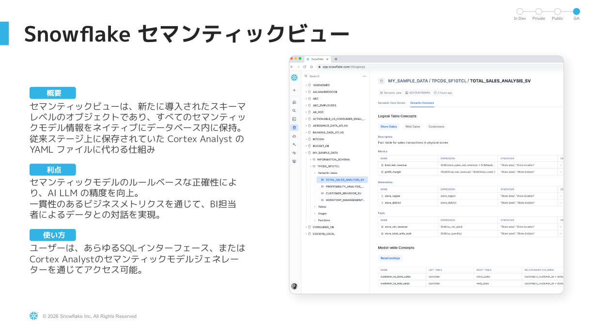

> テーブル列に "ビジネスの意味" を付与する仕組み。「TOTAL_PRICE は売上金額」「CATEGORY は商品カテゴリ」のように
> メトリクス・ディメンションを定義しておくと、**自然言語の質問が正しいSQLに翻訳** される。
> "Text-to-SQL の精度問題" を Semantic View が解消する。

**Cortex Search**

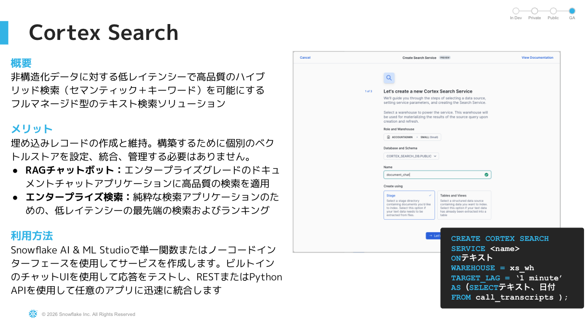
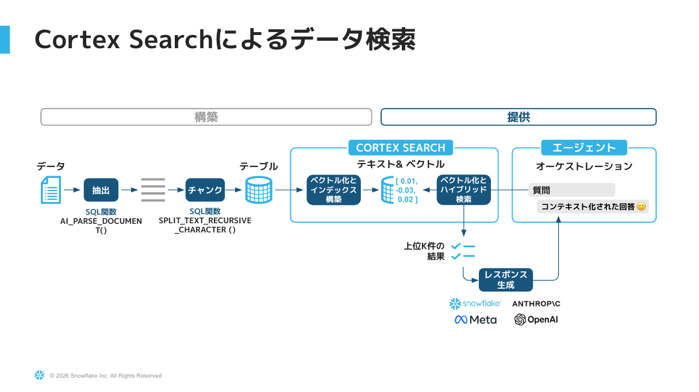

> Snowflake 上で動く **ハイブリッド検索（セマンティック + キーワード）** サービス。
> ベクトルDBを別途立てる必要なし。テーブルの列を指定するだけで、その内容を意味検索できる。
> 「返品ポリシーについて」のような質問で関連ドキュメントを引いてくる。

**Cortex Agent**

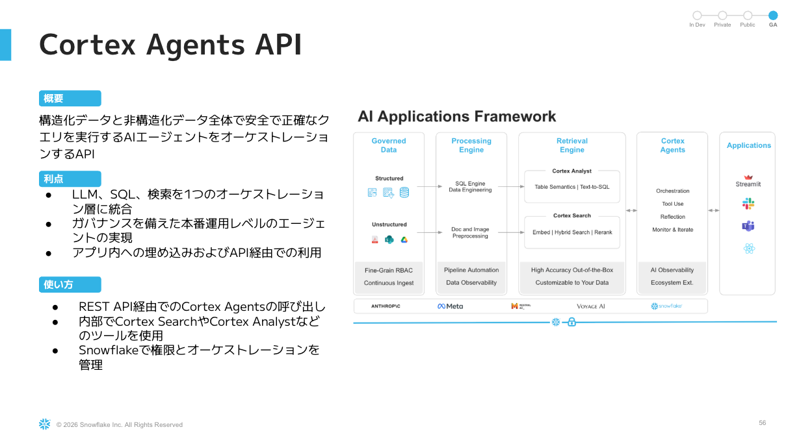
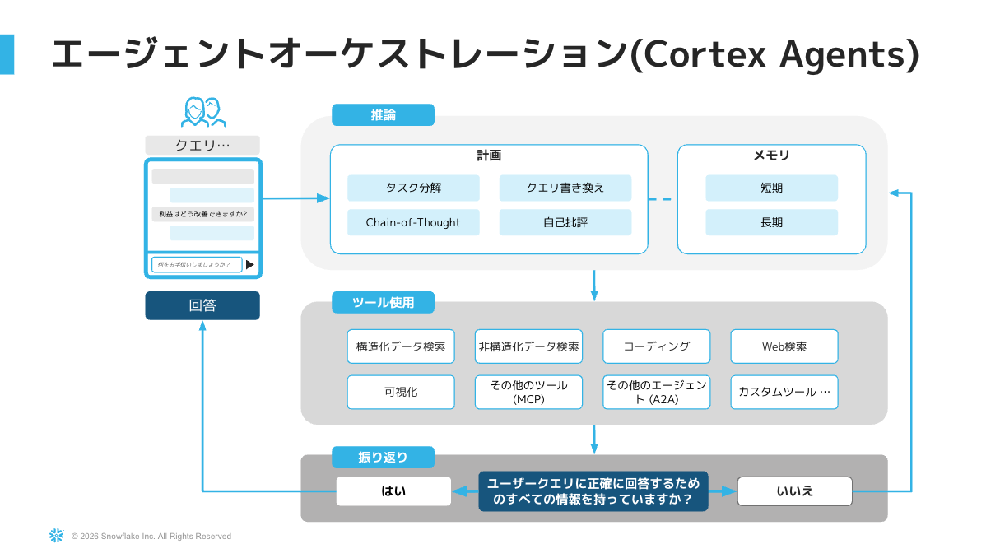

> Semantic View（数値）と Cortex Search（テキスト）を **ツールとして組み合わせた AI エージェント**。
> 質問に応じて自分でツールを選び、組み合わせて回答する。
> "RAG + Text-to-SQL を統合した AI アプリ" を **コードゼロ** で作れる。

**Snowflake Intelligence（参考）**

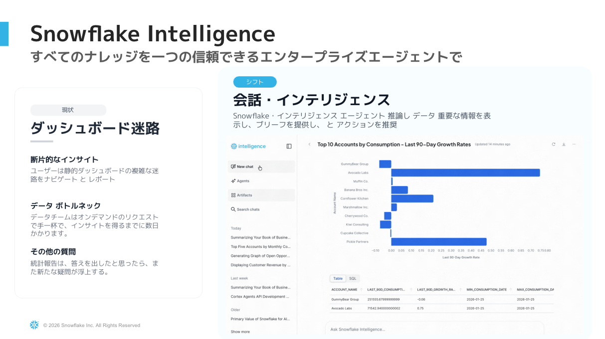
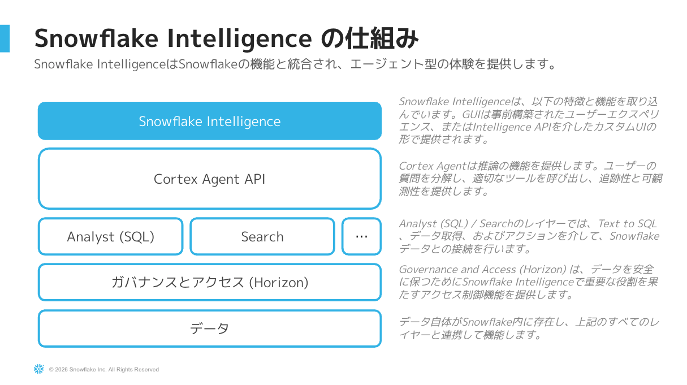

> Cortex Agent をエンドユーザー向けに公開する **対話型UI**。
> ビジネス部門の人が ChatGPT のようなチャット画面で、自社データに直接質問できる世界が標準で手に入る。

#### ✨ 得られる体験
> 部長の冒頭の質問が、その場で **数十秒** で答えられる。  
> しかも回答には「どのSQLを使ったか」「どの社内文書を参照したか」が **トレース可能** に出る。  
> AI のブラックボックス問題と、データ分析のスピード問題が同時に解ける。

---

### Step 4 — 定型業務をスキル化して全員に配布する
> *「毎月同じレポートを作るのが手間」を解決する*

#### こんな場面、ありませんか？
月初の風物詩。毎月1日、あなたは決まった手順で月次レポートを作っています。
1. 先月の売上を実店舗・EC別に集計
2. カテゴリ別ランキングTOP5
3. 売上上位商品TOP10
4. 前月比を計算

これを 12人 × 12ヶ月 = **年144回** 全社で繰り返している。

#### 💡 Snowflake はこう解決します
**Personal Skill** にこの手順を登録すれば、`/monthly-report` と打つだけで誰でも実行できます。

#### 🛠 ここで使う機能：**Skills（Personal Skills）**

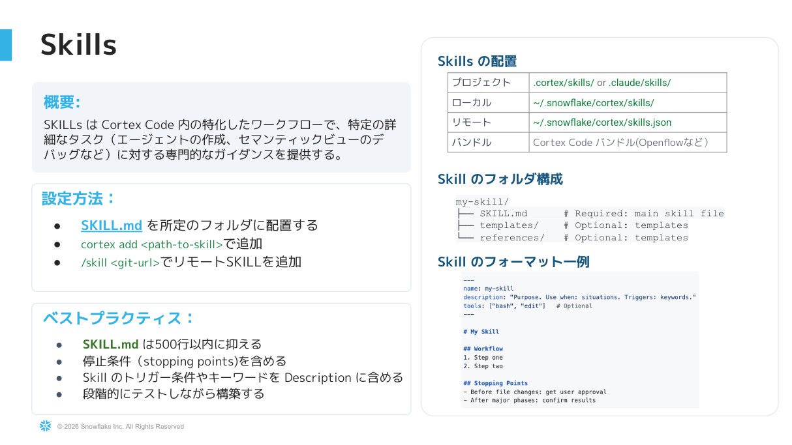

> Cortex Code の **再利用可能なスキルファイル**（Markdown）。Workspace の `.snowflake/cortex/skills/` に置く。
> - スキルには「手順」「使うデータソース」「出力フォーマット」を記述
> - 必要なら参照SQLや出力テンプレートも一緒にバンドル可能
> - メッセージボックスで `/` を入力すると候補が出てきて、ワンクリックで起動
>
> **個人の "うまいプロンプト" を、チームで共有・バージョン管理可能なアセット** に昇格させる仕組み。

#### ✨ 得られる体験
> 「あの人しか作れなかったレポート」が、新人でも `/monthly-report` で出せる。  
> **属人化の解消** と **生産性の標準化** が同時に達成される。

---

### Step 5 — Streamlit で誰でも触れるダッシュボードに
> *「現場のビジネス部門にも見せたい」を解決する*

#### こんな場面、ありませんか？
分析結果を共有しようとしたら、こう言われました。
> 「SQLは触れない。BIツール導入もしばらく無理。エクセルで毎週送って？」

毎週手作業でExcelを送る生活、いつまで続くのか…。

#### 💡 Snowflake はこう解決します
**Streamlit in Snowflake (SiS)** で、**Snowflake内で動くWebアプリ** をデプロイ。

#### 🛠 ここで使う機能：**Streamlit in Snowflake**

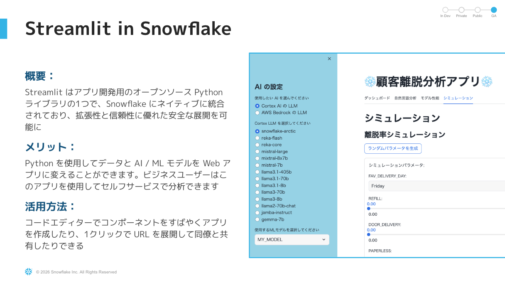

> Python で書ける Web アプリフレームワーク **Streamlit** を、**Snowflake の中でホスト** できる機能。
> - **データを動かさない:** アプリがデータの隣で動くので ETL も不要、レイテンシも最小
> - **権限はRBACそのまま:** Snowflake のロール/権限がそのままアプリの権限になる（追加のID管理不要）
> - **デプロイは1コマンド:** Cortex Code に「デプロイして」と言うだけ
> - **コーディング不要:** Cortex Code が要件から Streamlit コードを丸ごと生成してくれる
>
> "BIツールを買う・運用する" のと比較して、**圧倒的に低コストで現場配布できる** 選択肢。

#### ✨ 得られる体験
> 自然言語で要件を伝えてから **15分後** には、ビジネス部門が触れるダッシュボードのURLが手に入る。  
> 「データ基盤 → 分析 → アプリ配布」が **Snowflake1つで完結** する驚き。

---

## ハンズオンアーキテクチャ

```
[Step 1] データ準備・探索
    ↓
[Step 2] AGENTS.md（AIへの指示書でガバナンス）
    ↓
[Step 3] Semantic View → Cortex Search → Cortex Agent
    ↓
[Step 4] カスタムスキルで定型業務を自動化
    ↓
[Step 5] Streamlit ダッシュボードで可視化・配布
```

---

## 持ち帰ってほしいメッセージ

- Snowflake は **データ基盤 × AI × アプリ** が一体化したプラットフォームである
- Cortex Code in Snowsight は **インストール不要・ブラウザだけ** で AI 開発が完結する
- AGENTS.md / Skills により、**個人の生産性 → チームの生産性** に拡張できる
- 構造化・非構造化の両方を扱える Cortex Agent は、**業務の "考えるパートナー"** になる
