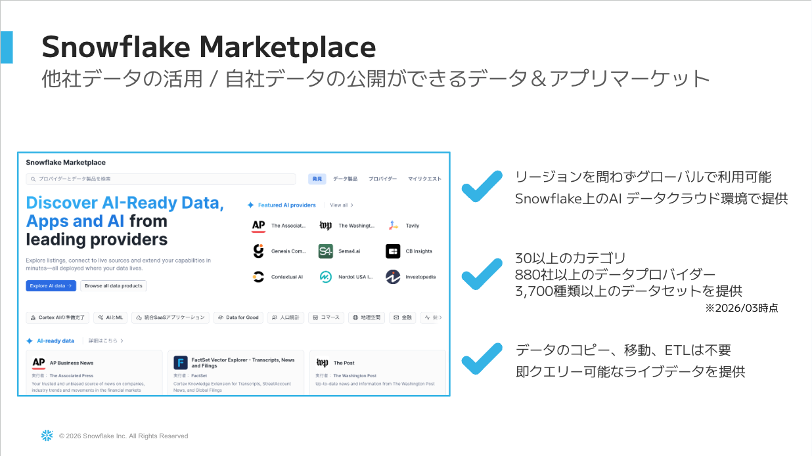
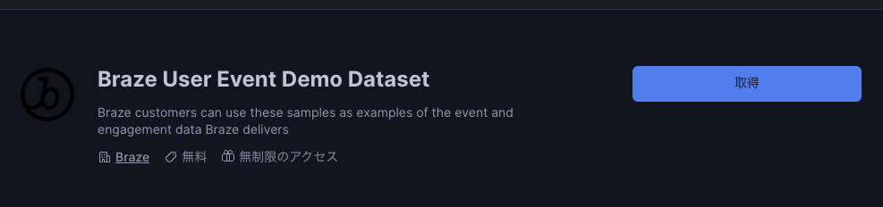
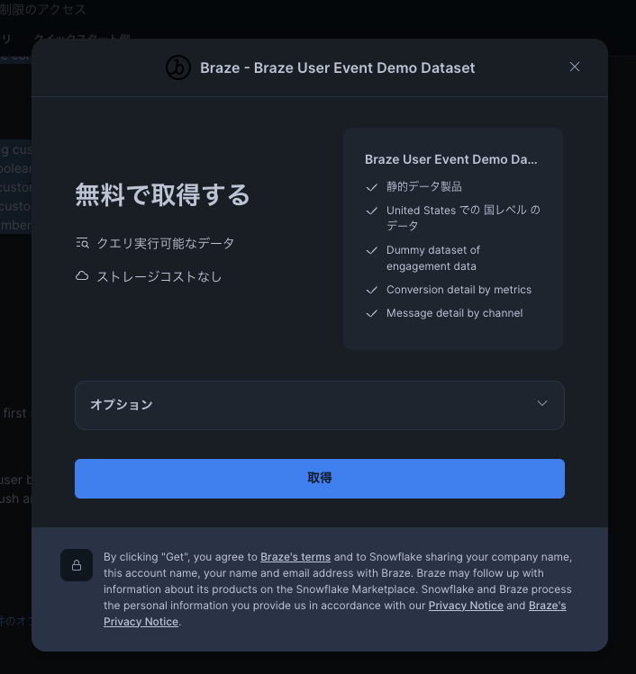

# 01. 環境準備（Setup）

このステップでは、ハンズオンで使用するSnowflake環境を準備します。

## 所要時間
**約10分**

## ゴール
- Marketplace から Braze デモデータが取得済み
- ハンズオン用のデータベース・スキーマ・ロールが作成済み
- 後続ステップ（Agent作成・MCP接続）の準備完了

---

## Step 1: Marketplace から Braze データを取得

### Snowflake Marketplace とは



**他社データの活用 / 自社データの公開ができるデータ＆アプリマーケット**

- ✅ **リージョンを問わずグローバルで利用可能** — Snowflake上のAIデータクラウド環境で提供
- ✅ **30以上のカテゴリ / 880社以上のデータプロバイダー / 3,700種類以上のデータセット**を提供（※2026/03時点）
- ✅ **データのコピー・移動・ETLは不要** — 即クエリ可能なライブデータを提供

今回はこのMarketplaceから、Braze社が公開しているサンプルデータセットを **取得（Get）** して利用します。
取得したデータは自社のSnowflakeアカウント上で **共有データベース** として即時にクエリ可能になります。

---

Snowsight にログインし、以下の手順で取得します。

### 手順
1. 左サイドメニュー → **Data Products** → **Marketplace** をクリック
2. 検索ボックスに `Braze User Event Demo Dataset` と入力
3. 該当リスティングを選択

   

4. **「無料で取得」（Get）** をクリック

   

5. オプション → **Database name**: `BRAZE_USER_EVENT_DEMO_DATASET`（デフォルト推奨）
6. **取得（Get）** をクリック

### 取得確認

```sql
SHOW DATABASES LIKE 'BRAZE_USER_EVENT_DEMO_DATASET';

-- ビュー件数確認（62本のビューがあれば成功）
SELECT COUNT(*)
FROM BRAZE_USER_EVENT_DEMO_DATASET.INFORMATION_SCHEMA.VIEWS
WHERE TABLE_SCHEMA = 'PUBLIC';
```

---

## Step 2: ハンズオン用ロール・DB・ウェアハウス作成

ACCOUNTADMIN または SYSADMIN で以下を実行します。

```sql
-- 実行ロール
USE ROLE SYSADMIN;

-- ハンズオン用データベース・スキーマ
CREATE DATABASE IF NOT EXISTS HANDSON_CORTEX_AGENT;
CREATE SCHEMA IF NOT EXISTS HANDSON_CORTEX_AGENT.BRAZE;

-- ハンズオン用ウェアハウス（XS推奨）
CREATE WAREHOUSE IF NOT EXISTS WH_HANDSON
  WITH WAREHOUSE_SIZE = 'XSMALL'
       AUTO_SUSPEND = 60
       AUTO_RESUME = TRUE
       INITIALLY_SUSPENDED = TRUE;
```

### ロール作成（任意：参加者を分離する場合のみ）

```sql
USE ROLE SECURITYADMIN;

-- ハンズオン用ロール
CREATE ROLE IF NOT EXISTS R_HANDSON;

-- 必要権限の付与
GRANT USAGE ON DATABASE HANDSON_CORTEX_AGENT TO ROLE R_HANDSON;
GRANT ALL ON SCHEMA HANDSON_CORTEX_AGENT.BRAZE TO ROLE R_HANDSON;
-- Marketplace（共有DB）には IMPORTED PRIVILEGES を使う
GRANT IMPORTED PRIVILEGES ON DATABASE BRAZE_USER_EVENT_DEMO_DATASET TO ROLE R_HANDSON;
GRANT USAGE ON WAREHOUSE WH_HANDSON TO ROLE R_HANDSON;

-- Cortex関連権限
GRANT DATABASE ROLE SNOWFLAKE.CORTEX_USER TO ROLE R_HANDSON;

-- ユーザーへロール付与（参加者ユーザー名に置換）
GRANT ROLE R_HANDSON TO USER <参加者ユーザー名>;
```

> 💡 **シンプルに進める場合**は、SYSADMIN や自身のロールでそのまま実施でもOKです。

---

## Step 3: ハンズオン用マートテーブル作成

Marketplaceのビューは件数が多い（EMAIL_SENDで638万件）ため、ハンズオン用に**サンプリング済みのマートテーブル**を作成します。

```sql
USE ROLE SYSADMIN;
USE DATABASE HANDSON_CORTEX_AGENT;
USE SCHEMA BRAZE;
USE WAREHOUSE WH_HANDSON;

-- メール送信マート（10万件にサンプリング）
CREATE OR REPLACE TABLE EMAIL_SENT AS
SELECT USER_ID, EXTERNAL_USER_ID, TIME AS SENT_AT,
       CAMPAIGN_ID, CAMPAIGN_API_ID, MESSAGE_VARIATION_ID,
       CANVAS_ID, CANVAS_API_ID,
       GENDER, COUNTRY, LANGUAGE, EMAIL_ADDRESS, IP_POOL
FROM BRAZE_USER_EVENT_DEMO_DATASET.PUBLIC.USERS_MESSAGES_EMAIL_SEND_VIEW
SAMPLE (100000 ROWS);

-- メール配信マート
CREATE OR REPLACE TABLE EMAIL_DELIVERY AS
SELECT USER_ID, EXTERNAL_USER_ID, TIME AS DELIVERED_AT,
       CAMPAIGN_ID, CAMPAIGN_API_ID, CANVAS_ID,
       COUNTRY, LANGUAGE, EMAIL_ADDRESS
FROM BRAZE_USER_EVENT_DEMO_DATASET.PUBLIC.USERS_MESSAGES_EMAIL_DELIVERY_VIEW
SAMPLE (100000 ROWS);

-- メール開封マート
CREATE OR REPLACE TABLE EMAIL_OPEN AS
SELECT USER_ID, EXTERNAL_USER_ID, TIME AS OPENED_AT,
       CAMPAIGN_ID, CAMPAIGN_API_ID, CANVAS_ID,
       COUNTRY, LANGUAGE, EMAIL_ADDRESS, USER_AGENT
FROM BRAZE_USER_EVENT_DEMO_DATASET.PUBLIC.USERS_MESSAGES_EMAIL_OPEN_VIEW
SAMPLE (50000 ROWS);

-- メールクリックマート
CREATE OR REPLACE TABLE EMAIL_CLICK AS
SELECT USER_ID, EXTERNAL_USER_ID, TIME AS CLICKED_AT,
       CAMPAIGN_ID, CAMPAIGN_API_ID, CANVAS_ID,
       URL, LINK_ALIAS, COUNTRY, LANGUAGE, EMAIL_ADDRESS
FROM BRAZE_USER_EVENT_DEMO_DATASET.PUBLIC.USERS_MESSAGES_EMAIL_CLICK_VIEW
SAMPLE (20000 ROWS);

-- キャンペーンコンバージョンマート
CREATE OR REPLACE TABLE CAMPAIGN_CONVERSION AS
SELECT USER_ID, EXTERNAL_USER_ID, TIME AS CONVERTED_AT,
       CAMPAIGN_ID, CAMPAIGN_API_ID, MESSAGE_VARIATION_ID,
       CONVERSION_BEHAVIOR_INDEX,
       GENDER, COUNTRY, LANGUAGE
FROM BRAZE_USER_EVENT_DEMO_DATASET.PUBLIC.USERS_CAMPAIGNS_CONVERSION_VIEW
SAMPLE (50000 ROWS);

-- キャンペーン収益マート
CREATE OR REPLACE TABLE CAMPAIGN_REVENUE AS
SELECT USER_ID, EXTERNAL_USER_ID, TIME AS REVENUE_AT,
       CAMPAIGN_ID, CAMPAIGN_API_ID, MESSAGE_VARIATION_ID,
       REVENUE, GENDER, COUNTRY, LANGUAGE
FROM BRAZE_USER_EVENT_DEMO_DATASET.PUBLIC.USERS_CAMPAIGNS_REVENUE_VIEW
SAMPLE (50000 ROWS);
```

### 確認

```sql
SELECT 'EMAIL_SENT' AS tbl, COUNT(*) FROM EMAIL_SENT UNION ALL
SELECT 'EMAIL_DELIVERY', COUNT(*) FROM EMAIL_DELIVERY UNION ALL
SELECT 'EMAIL_OPEN', COUNT(*) FROM EMAIL_OPEN UNION ALL
SELECT 'EMAIL_CLICK', COUNT(*) FROM EMAIL_CLICK UNION ALL
SELECT 'CAMPAIGN_CONVERSION', COUNT(*) FROM CAMPAIGN_CONVERSION UNION ALL
SELECT 'CAMPAIGN_REVENUE', COUNT(*) FROM CAMPAIGN_REVENUE;
```

---

## チェックポイント

✅ ここまでで以下が完了していればOKです：

- [ ] `BRAZE_USER_EVENT_DEMO_DATASET` が取得済み
- [ ] `HANDSON_CORTEX_AGENT.BRAZE` に6つのマートテーブルが作成済み
- [ ] `WH_HANDSON` ウェアハウスが作成済み

> 💡 認証は **PAT (Programmatic Access Token)** を使用します（[03_mcp](../03_mcp/README.md) Step 3 で発行）。

→ 続いて **[02_agent](../02_agent/README.md)** へ進みます。
