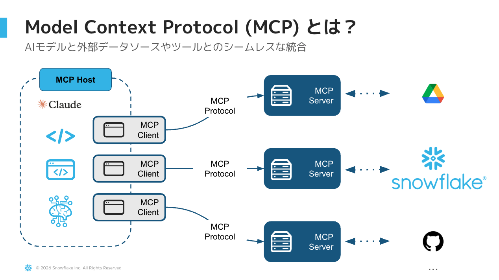
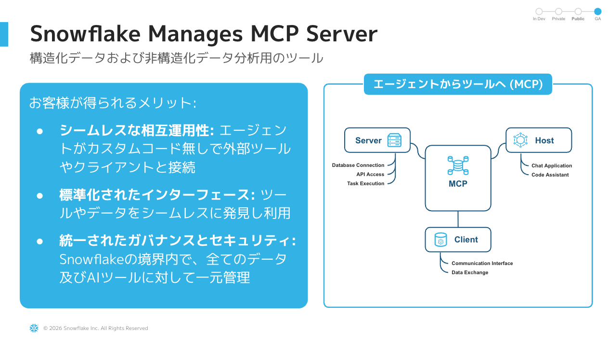
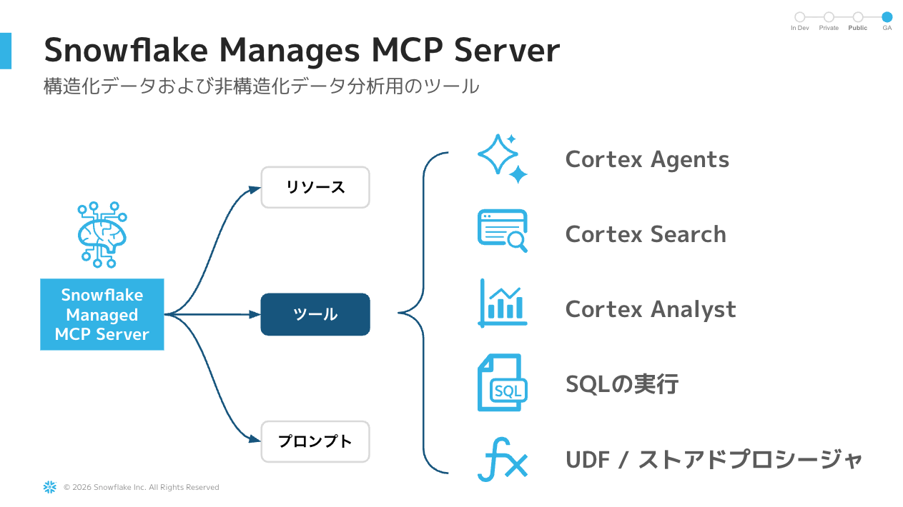

# 03. MCP連携（Snowflake-managed MCP Server + OAuth）

このステップでは、**Snowflake-managed MCP Server**（GA済み）を作成し、
**OAuth認証**で外部IDE（Kiro / Claude Desktop / Cursor等）から
ハンズオン2で作成した `BRAZE_AGENT` を直接呼び出せるようにします。

## 所要時間
**約35分**

## ゴール
- Snowflake上にMCPサーバ（`MCP SERVER`オブジェクト）が作成済み
- OAuth Security Integrationが設定済み
- KiroにOAuth経由でMCP接続が完了
- Kiroのチャットから自然言語でCortex Agentを叩ける状態

## 前提
- [02_agent](../02_agent/README.md) が完了していること
- Kiro（または Claude Desktop / Cursor）がローカルにインストール済み
- ACCOUNTADMINまたはSecurity Integrationを作成可能なロール

---

## Step 1: 仕組みの整理（5分）

### Model Context Protocol (MCP) とは？



MCP は、AIアプリ（**MCP Host / Client**）と外部ツール・データソース（**MCP Server**）の間の通信を標準化するオープンプロトコル。Kiro / Claude Desktop / Cursor 等のIDEはすべて MCP Client として動作します。

### Snowflake-managed MCP Server のメリット



- **相互運用性** — どのMCP Clientからでも接続可能
- **標準化されたインターフェース** — 統一されたツール公開
- **ガバナンス** — Snowflake RBAC・ネットワークポリシーがそのまま適用

### 公開できるツール



Cortex Agents / Cortex Search / Cortex Analyst / SQL 実行 / カスタムUDF をMCPツールとしてClient側に公開できます。

---

### Snowflake-managed MCP Server とは
- **Snowflakeが提供するマネージドMCPサーバ**（2025年11月GA）
- ローカルにMCPサーバを立ち上げる必要なし → **インフラ不要**
- Cortex Agent / Analyst / Search / SQL実行 / カスタムツールをツールとして公開
- **OAuth 2.0 ネイティブサポート**（推奨）／ PATも利用可
- RBACで細かく権限制御可能

### 全体像

```
┌──────────┐  自然言語   ┌──────────────────┐  MCP/HTTPS  ┌─────────────────────┐
│ User     │────────────▶│ Kiro             │────────────▶│ Snowflake-managed   │
│          │             │ (MCP Client)     │  OAuth      │ MCP Server          │
└──────────┘             └──────────────────┘             └──────────┬──────────┘
                                                                     │ RBAC
                                                                     ▼
                                                       ┌────────────────────────┐
                                                       │ BRAZE_AGENT       │
                                                       │ (Cortex Agent)         │
                                                       └────────────────────────┘
```

### なぜ OAuth？
- 公式の推奨方式（PATはハードコードによる漏洩リスクあり）
- ユーザー単位の認可・トークン更新が標準的に管理可能
- 本番運用にそのまま乗せられる

### 接続URL形式
```
https://<account_URL>/api/v2/databases/{database}/schemas/{schema}/mcp-servers/{name}
```

> ⚠️ **重要**: アカウント識別子に `_` が含まれる場合、ホスト名では `-` に変換すること。
> 例: `acme_test_account` → `acme-test-account`

---

## Step 2: MCP Server オブジェクトを作成（10分）

CoCo Web UI または Snowsight Worksheet から実行します。

### 2-1. ハンズオン用ロールに必要権限付与

```sql
USE ROLE SECURITYADMIN;

-- 既存ロール（または使用ロール）にCortex関連権限を付与
GRANT DATABASE ROLE SNOWFLAKE.CORTEX_USER TO ROLE R_HANDSON;

-- Agent利用権限
GRANT USAGE ON DATABASE HANDSON_CORTEX_AGENT TO ROLE R_HANDSON;
GRANT USAGE ON SCHEMA HANDSON_CORTEX_AGENT.BRAZE TO ROLE R_HANDSON;
GRANT USAGE ON AGENT HANDSON_CORTEX_AGENT.BRAZE.BRAZE_AGENT TO ROLE R_HANDSON;

-- Semantic View（Cortex Analyst利用）
GRANT SELECT ON SEMANTIC VIEW HANDSON_CORTEX_AGENT.BRAZE.SEMANTIC_VIEW_BRAZE_CAMPAIGN TO ROLE R_HANDSON;
```

### 2-2. MCP Server を作成

```sql
USE ROLE SYSADMIN;
USE DATABASE HANDSON_CORTEX_AGENT;
USE SCHEMA BRAZE;

CREATE OR REPLACE MCP SERVER BRAZE_MCP_SERVER
  FROM SPECIFICATION $$
tools:
  - name: "braze-agent"
    type: "CORTEX_AGENT_RUN"
    identifier: "HANDSON_CORTEX_AGENT.BRAZE.BRAZE_AGENT"
    description: "Brazeのメールキャンペーン分析エージェント。送信/開封/クリック/CV/収益を自然言語で分析できる。"
    title: "Braze Agent"

  - name: "braze-campaign-analyst"
    type: "CORTEX_ANALYST_MESSAGE"
    identifier: "HANDSON_CORTEX_AGENT.BRAZE.SEMANTIC_VIEW_BRAZE_CAMPAIGN"
    description: "Brazeメールキャンペーンのセマンティックビュー（直接Analyst呼び出し用）"
    title: "Braze Campaign Analyst"
$$;

-- 確認
SHOW MCP SERVERS IN SCHEMA HANDSON_CORTEX_AGENT.BRAZE;
DESC MCP SERVER BRAZE_MCP_SERVER;
```

### 2-3. MCP Server へのアクセス権限付与

```sql
USE ROLE SECURITYADMIN;

-- 接続権限とツール検出
GRANT USAGE ON MCP SERVER HANDSON_CORTEX_AGENT.BRAZE.BRAZE_MCP_SERVER TO ROLE R_HANDSON;
```

---

## Step 3: OAuth Security Integration 作成（10分）

OAuth認証で外部クライアント（Kiro）からSnowflakeに接続できるようにします。

### 3-1. Callback ポートは固定する

OAuth 2.0 仕様上、`redirect_uri` は必須です。Snowflake 側 (`OAUTH_REDIRECT_URI`) も
クライアント側もこの値が **完全一致** している必要があります。

Kiro が利用する `mcp-remote` は **`--port <number>` 引数で待ち受けポートを固定** できます。
本ハンズオンでは **`49153` を固定値** として採用し、Snowflake 側もこのポートで登録します。
これにより `redirect_uri_mismatch` を回避し、ALTER で URI を直す手間がなくなります。

> 💡 49153 が既に使用中の場合のみ、別の動的ポート（50153 / 51153 / 52153 / 53153 など）に
> 変更し、Security Integration の `OAUTH_REDIRECT_URI` と `mcp.json` の `--port` を
> 揃えて変更してください。

### 3-2. Security Integration 作成

```sql
USE ROLE ACCOUNTADMIN;

CREATE OR REPLACE SECURITY INTEGRATION BRAZE_MCP_OAUTH
  TYPE = OAUTH
  OAUTH_CLIENT = CUSTOM
  ENABLED = TRUE
  OAUTH_CLIENT_TYPE = 'CONFIDENTIAL'
  OAUTH_REDIRECT_URI = 'http://localhost:49153/oauth/callback'  -- 固定
  OAUTH_ISSUE_REFRESH_TOKENS = TRUE
  OAUTH_REFRESH_TOKEN_VALIDITY = 7776000  -- 90日
  OAUTH_USE_SECONDARY_ROLES = NONE;

-- OAuthクライアントID と クライアントシークレットを取得
SELECT SYSTEM$SHOW_OAUTH_CLIENT_SECRETS('BRAZE_MCP_OAUTH');
```

> 💡 `SYSTEM$SHOW_OAUTH_CLIENT_SECRETS` の引数は **大文字** で渡すこと。
> 返却JSONから `OAUTH_CLIENT_ID` と `OAUTH_CLIENT_SECRET` を控える。

---

## Step 4: Kiro に MCP を設定（10分）

### 4-1. mcp.json を直接編集

Kiro には MCP 用 GUI が無いため、`~/.kiro/settings/mcp.json` を編集します。
本ハンズオンでは `mcp-remote`（OAuth 2.0 + PKCE 対応プロキシ）経由で接続し、
**`--port 49153` でポートを固定** します。

```json
{
  "mcpServers": {
    "snowflake-braze": {
      "command": "npx",
      "args": [
        "mcp-remote",
        "https://<account_url>/api/v2/databases/HANDSON_CORTEX_AGENT/schemas/BRAZE/mcp-servers/BRAZE_MCP_SERVER",
        "--client-id",     "<OAUTH_CLIENT_ID>",
        "--client-secret", "<OAUTH_CLIENT_SECRET>",
        "--scope",         "session:role:R_HANDSON",
        "--port",          "49153"
      ],
      "disabled": false,
      "autoApprove": []
    }
  }
}
```

> ⚠️ `<account_url>` のアンダースコアは **ハイフン** に変換
> （例: `xy12345.us-east-1.snowflakecomputing.com`）。
> 詳細サンプルは `./mcp.json.template` を参照。

### 4-2. 前提

- Node.js / `npx` が実行可能であること（`npx --version` で確認）
- 初回起動時に `mcp-remote` が npm から自動取得される
- 49153 ポートが空いていること（`lsof -i :49153` で確認可能）

### 4-3. 接続フロー

1. `mcp.json` を保存
2. Kiro 左パネル → **MCP Servers** タブで `snowflake-braze` を再接続
   （または `Cmd+Shift+P` → "MCP" 検索 → 再接続コマンド）
3. ブラウザが自動で開く → Snowflake ログイン → Consent 画面で **Allow**
4. Kiro に戻ってツール一覧に `braze-agent` / `braze-campaign-analyst` が
   表示されれば成功

---

## Step 5: Kiro から動作確認（5分）

### サンプル質問集

```
@snowflake-braze BRAZE_AGENT で「直近のメール開封率トップ10キャンペーンは？」
```

```
@snowflake-braze 「国別のクリック率を比較して」
```

```
@snowflake-braze 「月次のCV件数推移を教えて」
```

→ Kiroが MCP 経由で Cortex Agent を呼び出し、結果を返してくれればOK。

---

## トラブルシュート

| 症状 | 原因 / 対処 |
|---|---|
| 認証画面が出ない | OAUTH_REDIRECT_URI が Kiro の Callback URL と一致しているか |
| 401 / 403 | ロールにMCP SERVER USAGE / Agent USAGE / Semantic ViewへのSELECTが付与されているか |
| Tool not found | `DESC MCP SERVER` で tool 定義確認、識別子が完全修飾名か |
| ホスト名解決エラー | URLの `_` を `-` に変換 |
| Refresh tokenが切れる | OAUTH_REFRESH_TOKEN_VALIDITY を延長、再認証 |
| Cortex機能利用不可 | エディション・リージョン・`SNOWFLAKE.CORTEX_USER` ロール付与確認 |

---

## おまけ: PAT認証で代用する場合

OAuthではなくPATで動作確認したい場合は、以下手順で代替可能です。
（**本番では非推奨**、検証用途のみ）

1. Snowsight → Settings → Authentication → **Programmatic Access Tokens** から発行
2. **Role restrictions: R_HANDSON** で最小権限化
3. クライアント設定の `auth` を以下に変更:

```json
"auth": {
  "type": "bearer",
  "token": "<your_pat>"
}
```

---

## チェックポイント

✅ ここまでで以下が完了していればOKです：

- [ ] `MCP SERVER BRAZE_MCP_SERVER` が作成済み
- [ ] OAuth Security Integration が有効
- [ ] Kiroに OAuth 経由で MCP サーバが認識されている
- [ ] Kiroチャットから `BRAZE_AGENT` を呼び出して回答が返る

→ 余裕があれば **[04_advanced](../04_advanced/README.md)** で発展課題に挑戦してください。

## 参考リンク

- [Snowflake-managed MCP server (公式ドキュメント)](https://docs.snowflake.com/en/user-guide/snowflake-cortex/cortex-agents-mcp)
- [CREATE SECURITY INTEGRATION (Snowflake OAuth)](https://docs.snowflake.com/en/sql-reference/sql/create-security-integration-oauth-snowflake)
- [Resolving Cursor IDE and Claude Desktop Authentication Errors](https://community.snowflake.com/s/article/resolving-mcp-server-authentication-errors-cursor-claude)
