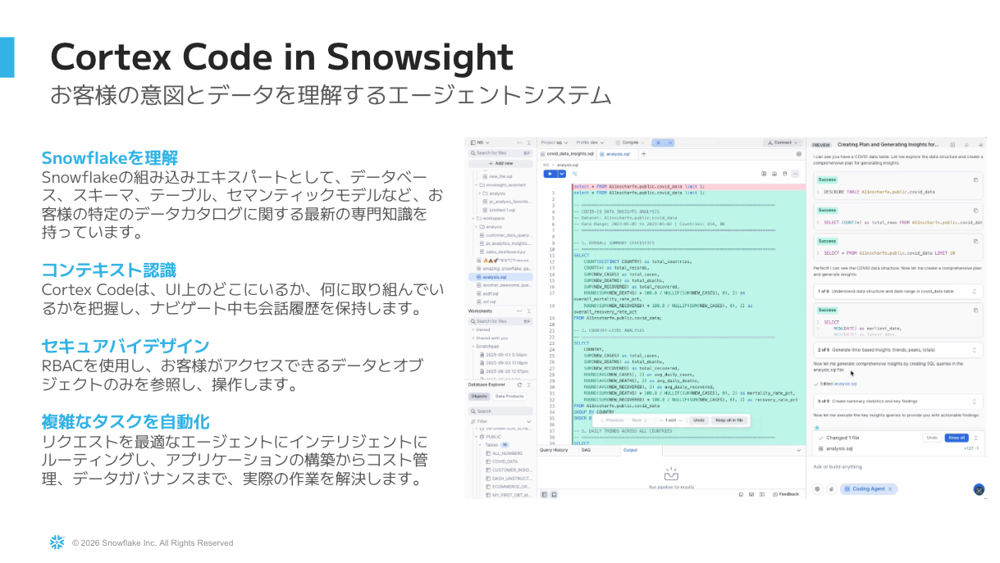
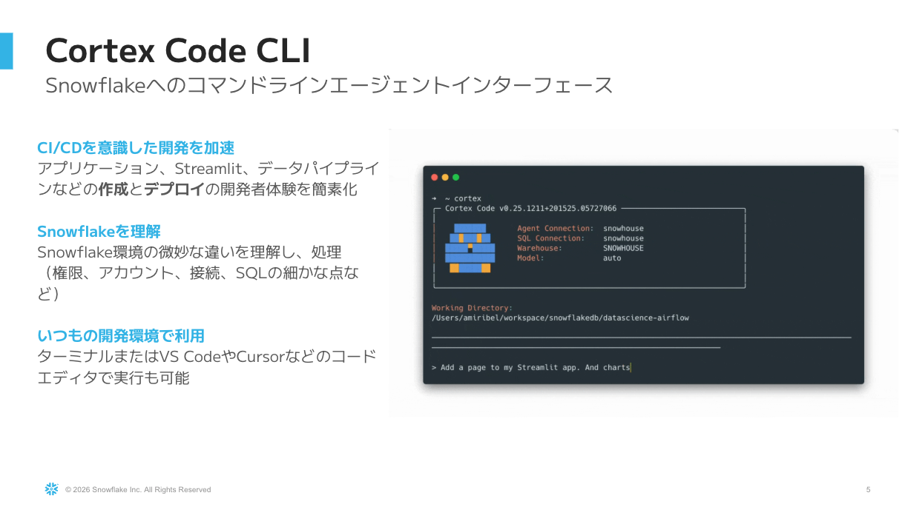
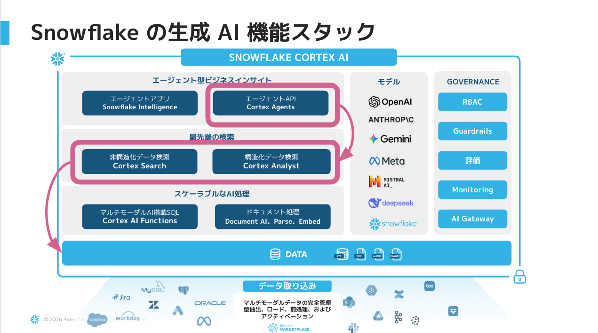

# Cortex Agent × MCP ハンズオン

**Snowflake Cortex Agent を作成し、外部IDE（Kiro / Claude Desktop等）からMCP経由で呼び出す**ハンズオンです。
データ分析エージェントを作って、普段使いのIDEから自然言語で叩ける状態を体験します。

---

## 🛠️ 本ハンズオンの開発環境: Cortex Code (CoCo)

本ハンズオンでは、エージェント・セマンティックビュー・SQLの作成にあたり、
Snowflakeの **AI開発エージェント = Cortex Code (CoCo)** を活用します。
**自然言語の指示だけ** でSnowflake上のリソースを構築・操作できる開発体験を体感していただきます。

### Cortex Code in Snowsight（Web UI）

**お客様の意図とデータを理解するエージェントシステム**

- 🎯 **Snowflakeを理解** — DB・スキーマ・テーブル・セマンティックモデル等のデータカタログに関する最新の専門知識を持つ
- 🧭 **コンテキスト認識** — UI上のどこにいるか・何に取り組んでいるかを把握、ナビゲート中も会話履歴を保持
- 🔒 **セキュアバイデザイン** — RBACに準拠し、ユーザーがアクセス可能なデータ・オブジェクトのみ操作
- 🤖 **複雑なタスクを自動化** — 適切なエージェントに自動ルーティング、アプリ構築〜コスト管理〜データガバナンスまで対応

> 本ハンズオンでは **Snowsight内蔵のCortex Code (Web UI)** を使用するため、**インストール不要・ブラウザのみで参加可能**。

### Cortex Code CLI（参考）

**Snowflakeへのコマンドラインエージェントインターフェース**

- 🚀 **CI/CDを意識した開発を加速** — アプリ・Streamlit・データパイプライン等の作成とデプロイの開発者体験を簡素化
- 🧠 **Snowflakeを理解** — 権限・アカウント・接続・SQLの細かな差異まで把握
- 💻 **いつもの開発環境で利用** — ターミナル / VS Code / Cursor 等のコードエディタから実行可能

> CLI版は本ハンズオン後の発展利用としてご紹介します。

---

---

## 🧠 Snowflake の生成AI機能スタック

本ハンズオンではこのスタックの中の **Cortex Agent** を自作し、外部IDEから MCP 経由で呼び出します。

---

## 想定所要時間
**約2時間**

## 想定対象
- Snowflakeを利用しているデータエンジニア・アナリスト・開発者
- 自然言語データ分析（Cortex Analyst）に触れてみたい方
- AIエージェント × MCPの組み合わせを業務に取り入れたい方

## 前提条件
- Snowflakeアカウント（Cortex機能利用可能なリージョン・エディション）
- モダンブラウザ（Chrome / Edge / Safari 最新版）
- Kiro または Claude Desktop（MCPホストとして利用）
- Snowflake Marketplace から共有データをGet可能な権限

## ゴール
- Snowflake Marketplace のサンプルデータ（Braze）を取り込む
- セマンティックビューを作成する
- Cortex Agent を作成し、自然言語で質問できる状態にする
- Kiro等の外部IDEから MCP 経由で Agent を呼び出せる状態にする

## ステップ概要

| ステップ | フォルダ | 内容 |
|---|---|---|
| 1 | [`01_setup/`](./01_setup/) | 環境準備（Marketplace Get / ロール / PAT発行） |
| 2 | [`02_agent/`](./02_agent/) | セマンティックビュー作成 → Cortex Agent作成 |
| 3 | [`03_mcp/`](./03_mcp/) | Kiro / Claude Desktop に Snowflake MCP設定 |
| 4 | [`04_advanced/`](./04_advanced/) | 発展課題（実データへの置換・他Agent統合等） |
| Appendix | [`appendix_search/`](./appendix_search/) | Cortex Search 概要（本編対象外・補足） |

## 使用データ

**Braze User Event Demo Dataset**
- 取得元: [Snowflake Marketplace](https://app.snowflake.com/marketplace/listing/GZT0Z5I4XY0/braze-braze-user-event-demo-dataset)
- 参考: [AI-Powered Campaign Analytics with Braze and Snowflake Cortex (Quickstart)](https://www.snowflake.com/en/developers/guides/braze-email-engagement-analytics-cortex/)

## 進め方

1. このREADMEを読んでゴールを把握
2. `01_setup/README.md` から順に進める
3. 各ステップは独立して動作するよう構成

## 参考リンク

- [Snowflake Cortex Agent ドキュメント](https://docs.snowflake.com/en/user-guide/snowflake-cortex/cortex-agents)
- [Snowflake Semantic Views](https://docs.snowflake.com/en/user-guide/views-semantic/overview)
- [Cortex Code (CoCo) ドキュメント](https://docs.snowflake.com/en/user-guide/cortex-code/cortex-code)
- [Model Context Protocol (MCP) 公式](https://modelcontextprotocol.io/)
- [mcp-server-snowflake (GitHub)](https://github.com/Snowflake-Labs/mcp)
