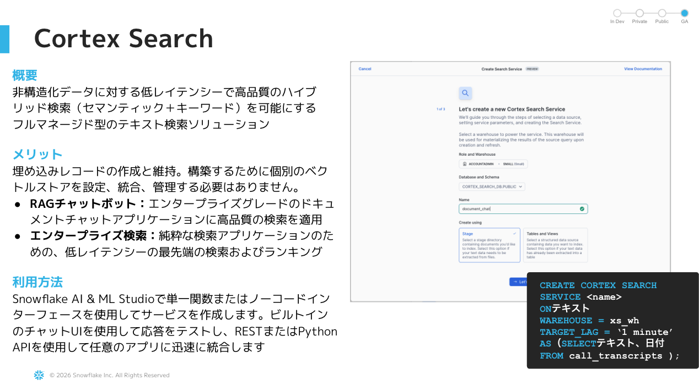
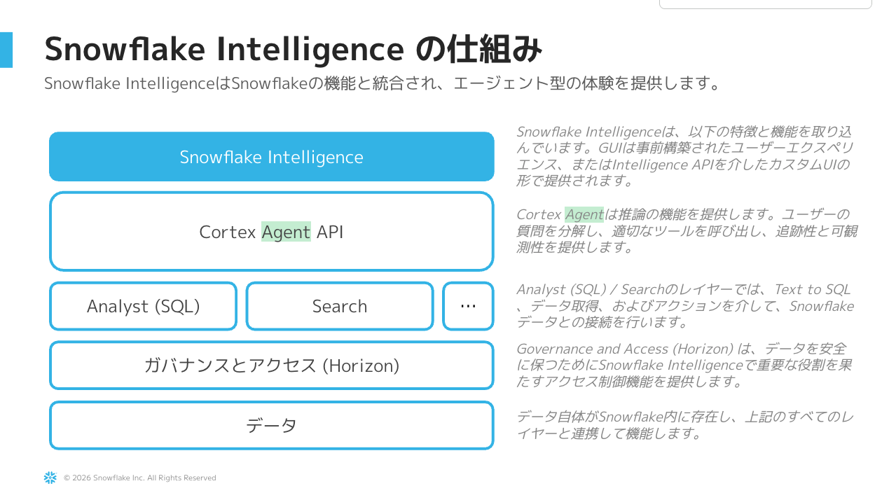

# Appendix: Cortex Search

> ⚠️ **本セクションは本編ハンズオンには含まれません。** 興味のある方向けの補足資料です。

Cortex Agent は構造化データ向けの **Cortex Analyst** と並んで、非構造化データ（ドキュメント・テキスト）を扱う **Cortex Search** をツールとして利用できます。本Appendixでは Cortex Search の概要を紹介します。

---

## Cortex Search とは

社内ドキュメント・PDF・チャット履歴等の非構造化テキストに対して、**ハイブリッド検索（ベクトル + キーワード）** をフルマネージドで提供するサービス。RAG（Retrieval-Augmented Generation）の検索基盤として利用できます。

## 仕組み

**Build フェーズ**: ソーステーブル/ステージのテキストを自動でチャンク化・埋め込み生成し、検索インデックスを構築。
**Serve フェーズ**: クエリに対してハイブリッド検索 → 関連チャンクを返却。Cortex Agent から呼び出すと Analyst の構造化結果と組み合わせた回答が可能です。

---

## 発展課題: BRAZE_AGENT に Cortex Search を追加してみる

例えば以下のような拡張が考えられます:

- **キャンペーン企画書のPDF** をステージにアップロード → Cortex Search Service を作成
- `BRAZE_AGENT` に Search ツールを追加
- 「Q1のキャンペーン目的とKPIを教えて」のような質問で、構造化データ（実績）と非構造化データ（企画書）を横断回答

### 参考リンク

- [Cortex Search ドキュメント](https://docs.snowflake.com/en/user-guide/snowflake-cortex/cortex-search/cortex-search-overview)
- [Cortex Search Quickstart](https://quickstarts.snowflake.com/guide/cortex_search_tutorial_1_basic_chatbot/)
